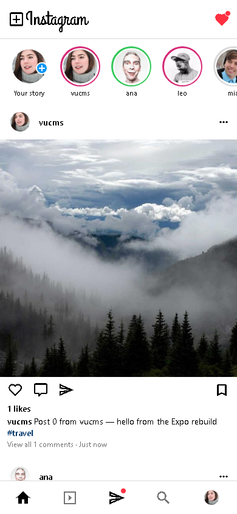
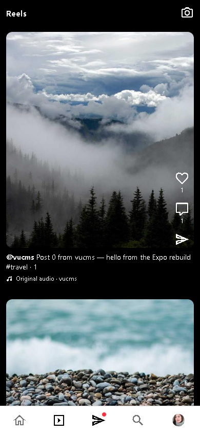
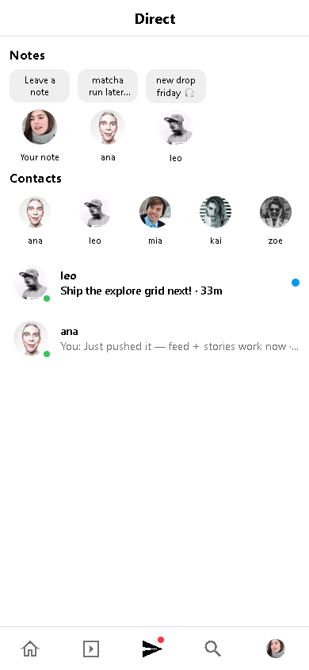
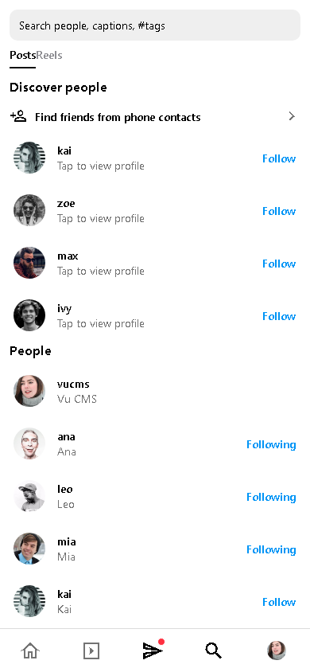
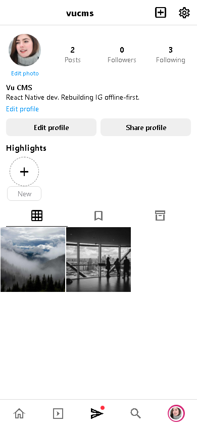

# instagram-clone

[](https://github.com/0x-Shadow/instagram-clone/actions/workflows/ci.yml)
[](LICENSE)
[](expo-app/)

A local-first Instagram rebuild with Expo (feed, stories, reels, DMs, search,
camera, dark mode) — plus the legacy React Native 0.62 app it grew out of.
All upstream secrets were purged; this is a clean, collaboration-ready import.

> Derived from
> [iamvucms/react-native-instagram-clone](https://github.com/iamvucms/react-native-instagram-clone)
> (MIT). Firebase / Mapbox keys and Android release passwords from upstream
> were removed — bring your own (see Configuration).

## Screenshots

| Feed | Reels | Messages | Search | Profile |
|------|-------|----------|--------|---------|
|  |  |  |  |  |

(Screenshots are captured from the Expo web export — see
`docs/screenshots/README.md` for how they were taken.)

## What's inside

| Path | What it is | Status |
|------|------------|--------|
| `expo-app/` | **Active app.** Expo SDK 57, RN 0.86, TypeScript strict, AsyncStorage persistence, haptics. Feed, stories + viewer, reels, DMs/threads, search, profile, camera capture, contacts import, place tagging, bookmarks, settings. | ✅ Develop here |
| `src/`, `android/`, `ios/`, `App.tsx` | Legacy RN 0.62 + Firebase reference implementation. | 📦 Reference only |
| `docs/ROADMAP.md` | Phased plan: modularize → Supabase backend → notifications/deep links → one differentiator. | 📖 Start here |
| `.env.example` | Placeholder config. No real keys in this repo. | 🔑 Copy locally |

## Quickstart (expo-app)

```bash
cd expo-app
npm install
npx expo start        # scan the QR with Expo Go
# or
npm run web           # run in the browser
```

Checks (also run in CI):

```bash
cd expo-app
node scripts/check.mjs   # persistence harness — 8/8 expected
npx tsc --noEmit         # must be clean
```

> [!NOTE]
> Read `expo-app/AGENTS.md` before writing code: Expo SDK 57 has breaking
> changes vs older versions — always check the
> [versioned docs](https://docs.expo.dev/versions/v57.0.0/).

## Legacy app (reference only)

```bash
git clone https://github.com/0x-Shadow/instagram-clone.git
cd instagram-clone
yarn
cd ios && pod install
npx react-native run-ios   # RN 0.62 — expect toolchain friction on modern machines
```

The legacy image-classify API is optional:
`CLASSIFY_API=http://YOUR_PRIVATE_IP:YOUR_PORT/classify`
([upstream installer](https://github.com/iamvucms/ImageClassifyAPI/blob/master/README.md#installation)).

## Configuration

Copy `.env.example` and fill in your own values locally. Never commit `.env`,
keystores, `google-services.json`, or `GoogleService-Info.plist` — CI fails
closed PRs that contain known-leaked secrets.

## Contributing

PRs welcome — small and focused wins. Open an issue first for anything large.

1. Branch from `main`: `git checkout -b feat/short-description`
2. Run the checks above; update docs if behavior changes
3. Open a PR with the template (tests + screenshots where relevant)

Details: [`CONTRIBUTING.md`](CONTRIBUTING.md) · [`CODE_OF_CONDUCT.md`](CODE_OF_CONDUCT.md) · [`SECURITY.md`](SECURITY.md)

## License

[MIT](LICENSE) © 2026 0x-Shadow. Legacy-app portions remain under their
original MIT terms — see `LICENSE` for attribution.
